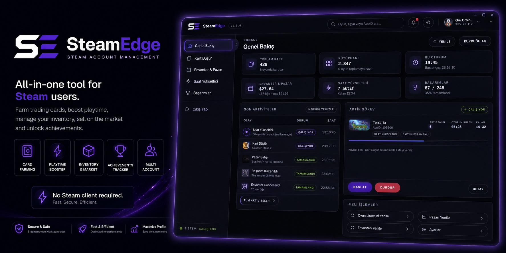

<div align="center">



# SteamEdge

**Steam ticaret kartı topla, oynanma süresi yükselt, başarım yönet ve Topluluk Pazarı'nda sat - Steam istemcisi çalıştırmadan.**

[](../../LICENSE)
[](https://github.com/Miabeyefendi/steamedge/releases/latest)
[](https://github.com/Miabeyefendi/steamedge/releases)
[](https://github.com/Miabeyefendi/steamedge/releases/latest)

[English](../../README.md) · **Türkçe** · [Deutsch](../de/README.md) · [Español](../es/README.md) · [繁體中文](../zh/README.md)

[İndir](https://github.com/Miabeyefendi/steamedge/releases/latest) · [Kurulum](./SETUP.md) · [Kullanım](./TUTORIAL.md) · [Tüm ayarlar](./INSTRUCTIONS.md) · [SSS](./FAQ.md)

</div>

---

## Nedir

SteamEdge, Steam ile kendi ağ protokolü üzerinden konuşan bir masaüstü uygulamasıdır.
Hesabınla oturum açar, oyunları "oynanıyor" olarak bildirir ve Steam'in bunlar için
düşürdüğü ticaret kartlarını toplar. Steam istemcisinin açık olması gerekmez, hiçbir oyun
indirilmez veya çalıştırılmaz, hiçbir sürece müdahale edilmez.

Ayrıca oynanma süresi yükseltir, başarım açar veya kilitler ve gerçek Topluluk Pazarı
verisini okur; böylece kartlarını uygulamadan çıkmadan fiyatlandırıp satabilirsin.

> **Valve Corporation ile bir ilişkisi yoktur.** Steam ve Steam logosu Valve'ın tescilli
> markalarıdır. Kullanım riski sana aittir - [Sorumluluk Reddi](#sorumluluk-reddi).

## Özellikler

| | |
|---|---|
| **Kart düşürme** | Beş mod: sıralı, çok kartlı, az kartlı, öncelikli ve Steam'in 2 saat kuralını bilen Hızlı mod. |
| **Çoklu hesap** | Aynı anda birden fazla hesapla oturum aç. Arka planda paralel çalışırlar; pencere hangisine geçtiysen onu gösterir. |
| **Saat yükseltici** | Aynı anda 32 oyuna kadar açık tut. İsteğe bağlı **saat eşitleme** farklı süreleri kademe kademe aynı noktaya getirir. |
| **Başarımlar** | Gerçek açılma durumunu protokolden okur, toplu aç/kilitle, güvenli mod ve rastgele aralıklarla. |
| **Envanter ve Pazar** | Gerçek sipariş defteri (satıştaki ilanlar + alım talimatları) ve gerçek satış geçmişi. Değer **gerçekleşmiş satışlardan** gelir, tek bir şişirilmiş ilandan değil. |
| **Steam istemcisi gerekmez** | Her şey Steam ağ protokolü üzerinden çalışır. Oyun dosyası yok, kaplama yok, enjeksiyon yok. |
| **Taşınabilir** | Aç ve çalıştır. Ayarlar ve önbellek exe'nin yanında durur; kayıt defterine hiçbir şey yazılmaz. |
| **5 dil** | English, Türkçe, Deutsch, Español, 繁體中文. |

## Hızlı başlangıç

1. [Sürümler](https://github.com/Miabeyefendi/steamedge/releases/latest) sayfasından
   `SteamEdge-vX.Y.Z-win-x64.zip` dosyasını indir.
2. Yazma izni olan bir yere çıkar (Masaüstü, USB bellek, herhangi bir yer).
3. `SteamEdge.exe` dosyasını çalıştır.
4. QR kodu Steam mobil uygulamasıyla okut ya da kullanıcı adı ve şifreyle giriş yap.
5. **Kart Düşür** sekmesini aç ve **Başlat**'a bas.

Ekran görüntülü tam anlatım: [Kurulum](./SETUP.md).

## Karşılaştırma

| | SteamEdge | Idle Master | ArchiSteamFarm |
|---|---|---|---|
| Steam istemcisi gerekir | Hayır | Evet | Hayır |
| Aynı anda çoklu hesap | Evet | Hayır | Evet |
| Grafik arayüz | Evet | Evet | Web arayüzü |
| Saat yükseltme | Evet | Hayır | Hayır |
| Başarım yöneticisi | Evet | Hayır | Hayır |
| Yerleşik pazar satışı | Evet | Hayır | Hayır |
| Taşınabilir (kurulum yok) | Evet | Evet | Evet |

Bu tablo kapsamla ilgilidir, kaliteyle değil. ArchiSteamFarm çok daha olgun bir projedir ve
büyük ölçekli, arayüzsüz, çok hesaplı kullanım için daha doğru tercihtir. SteamEdge ise
kart, saat, başarım ve satışı tek pencerede isteyen tek bir masaüstü kullanıcısını hedefler.

## Nasıl çalışır

Steam bir oyun için kart düşürmeye ancak toplam oynanma süresi **2 saati** geçtikten sonra
başlar. SteamEdge, gerçek Steam istemcisinin gönderdiği `ClientGamesPlayed` mesajının
aynısını gönderir; Steam süreyi sayar ve kartları normal şekilde düşürür.

- **Hızlı mod** önce 2 saatin altındaki her oyunu eşiğe çeker - paralel olarak, çünkü
  Steam eşzamanlı açık her oyuna süre işler - sonra hepsini açık tutup öne çıkan oyunu
  1,5-2 dakikada bir değiştirir.
- **Öğe değeri**, Steam fiyat geçmişindeki *gerçekleşmiş satışların* adetle ağırlıklı
  medyanıdır. Satıştaki ilanlar ayrı gösterilir ve değere hiç girmez; tek bir satıcının
  999.999 dolara koyduğu ilan değeri oynatmamalıdır.
- **Fiyatlar hesabının kendi cüzdan kurunda** çekilir, Steam Topluluk Pazarı'ndan okunur ve
  tam olarak o kurda gösterilir. Hiçbir yerde çeviri yapılmaz.

## Gereksinimler

- Windows 10 veya 11, 64 bit
- Bir Steam hesabı (Steam Guard mobil doğrulayıcı önerilir)
- İnternet bağlantısı

Başka hiçbir şey. .NET yok, Node.js yok, Steam istemcisi yok.

## Kaynaktan derleme

```bash
git clone https://github.com/Miabeyefendi/steamedge.git
cd SteamEdge
npm install
npm start          # geliştirme modunda çalıştır
npm run build      # ../Release Vx.y.z altında taşınabilir sürüm üret
```

Node.js 20 veya üstü gerekir. Ayrıntı: [CONTRIBUTING.md](../../CONTRIBUTING.md).

## Belgeler

| Kılavuz | İçeriği |
|---|---|
| [Kurulum](./SETUP.md) | İndirme, ilk açılış, giriş, ek hesap ekleme |
| [Kullanım](./TUTORIAL.md) | İlk kartını toplama, saat yükseltme, öğe satma |
| [Ayarlar](./INSTRUCTIONS.md) | Her ayarın ne yaptığı ve ne seçmen gerektiği |
| [SSS](./FAQ.md) | Ban, güvenlik, istek limitleri, sorun giderme |

## Güvenli mi?

Karar vermeden önce [FAQ.md](./FAQ.md) dosyasını oku. Kısa hâli:

- SteamEdge yalnızca resmi Steam istemcisinin de gönderdiği mesajları gönderir. Oyun
  dosyası değiştirmez, Steam Web API anahtarı kullanmaz, başka oyunculara dokunmaz.
- Şifren hiçbir yere kaydedilmez. Steam bir yenileme anahtarı verir; o anahtar exe'nin
  yanındaki `settings/` klasöründe tutulur. O klasörü bir şifre gibi koru.
- Yüzlerce başarımı saniyeler içinde açmak herkese açık profilinde görünür. Güvenli mod
  boşuna yok - açık bırak.
- Hesabını otomatikleştirmek Steam Abonelik Sözleşmesi'ne aykırıdır. Kimse sana işlem
  yapılmayacağının sözünü veremez. Bu riski kendin kabul edersin.

## Katkı

Hata bildirimi, çeviri ve pull request'ler açıktır.
[CONTRIBUTING.md](../../CONTRIBUTING.md) ve [Davranış Kuralları](../../CODE_OF_CONDUCT.md)
ile başla. Güvenlik açıkları için genel bir issue açmak yerine
[SECURITY.md](../../SECURITY.md) yolunu izle.

## Teşekkürler

SteamEdge sıfırdan yazılmış bağımsız bir uygulamadır. Aşağıdaki projelerden **kod
alınmamıştır**; her biri Steam'in nasıl çalıştığını anlamak için incelenmiş, çözdükleri
problemler ve tercih ettikleri yaklaşımlar bize fikir vermiştir.

| Proje | Ne öğrendik | Yazar |
|---|---|---|
| [Idle Master](https://github.com/jshackles/idle_master) | Temel fikir: kart düşürme, Steam istemcisi açmadan, oyunu "oynanıyor" göstererek yapılabilir. | [@jshackles](https://github.com/jshackles) |
| [Idle Master Extended](https://github.com/JonasNilson/idle_master_extended) | Özgün proje arşivlendikten sonra Steam tarafında ne değişti ve hangi ayarları sunmak işe yarıyor. | [@JonasNilson](https://github.com/JonasNilson) |
| [HourBoostr](https://github.com/ezzpify/HourBoostr) | Birden çok oyunun aynı anda açık tutulabildiği ve bunun süre işlemesi açısından anlamı. | [@ezzpify](https://github.com/ezzpify) |
| [Steam Achievement Manager](https://github.com/gibbed/SteamAchievementManager) | Başarımların oyun açılmadan okunup değiştirilebildiği. | [@gibbed](https://github.com/gibbed) |
| [ArchiSteamFarm](https://github.com/JustArchiNET/ArchiSteamFarm) | Uzun süre çalışan arayüzsüz bir Steam oturumunu sağlıklı tutmak, maFile kullanımı ve çoklu hesap. | [@JustArchi](https://github.com/JustArchi) |

Uygulamanın Steam ile konuşan kısmı [@DoctorMcKay](https://github.com/DoctorMcKay) ve
katkıda bulunanların açık kaynak
[steam-user](https://github.com/DoctorMcKay/node-steam-user),
[steam-session](https://github.com/DoctorMcKay/node-steam-session),
[steam-totp](https://github.com/DoctorMcKay/node-steam-totp) ve
[qrcode](https://github.com/soldair/node-qrcode) paketlerini kullanır. Bunun dışındaki tüm
kod SteamEdge'e aittir.

## Lisans

Bu proje **GNU Affero General Public License v3.0 (AGPL-3.0)** ve
[LICENSE](../../LICENSE) dosyasındaki ek koşullarla lisanslanmıştır. Kısaca:

- Yazılımı ücretsiz kullanabilir, inceleyebilir, değiştirebilir, dağıtabilir ve hatta
  paraya çevirebilirsiniz; **yeter ki** kaynak kodun tamamını AGPL-3.0 altında erişilebilir
  tutun (barındırılan/SaaS/ağ üzerinden kullanım dahil - AGPL 13. madde) ve aşağıdaki yazar
  atfını koruyun.
- Kapalı kaynak veya tescilli bir üründe kullanmak ya da kapalı bir SaaS olarak çalıştırmak
  için **ayrı bir yazılı ticari lisans** gerekir (telif/gelir paylaşımı içerebilir).
  [LICENSE](../../LICENSE) 8. bölüme bakın ve benimle iletişime geçin.

### Atıf (zorunlu)

AGPL-3.0 7(b) maddesi uyarınca aşağıdaki atıf, projenin her kopyasında, çatalında ve
dağıtımında görünür ve değiştirilmemiş biçimde korunmalıdır:

> **Miabeyefendi (Mustafa Ihsan Albayrak)** - https://github.com/Miabeyefendi

Bkz. [NOTICE](../../NOTICE).

## Sorumluluk Reddi

Bu yazılım hiçbir garanti verilmeksizin "olduğu gibi" sunulur. Tamamen kendi riskinizle
çalıştırırsınız ve Steam Abonelik Sözleşmesi'ne uymak dahil kullanımınızdan yalnızca siz
sorumlusunuz. Valve Corporation bu projeyle ilişkili değildir ve onaylamamaktadır; Steam ve
ilgili markalar sahiplerine aittir. Yazar, yürürlükteki yasaların izin verdiği azami ölçüde
hesap yasaklamaları, veri kaybı veya başka zararlar için sorumluluk kabul etmez. Tam
koşullar [LICENSE](../../LICENSE) dosyasındadır.

## İletişim

- GitHub: [@miabeyefendi](https://github.com/Miabeyefendi)
- Ticari lisans veya gelir paylaşımı için GitHub profilim üzerinden ulaşabilirsiniz.

---

<div align="center">
<sub><a href="https://github.com/Miabeyefendi">Miabeyefendi</a> tarafından geliştirildi · AGPL-3.0-or-later</sub>
</div>
